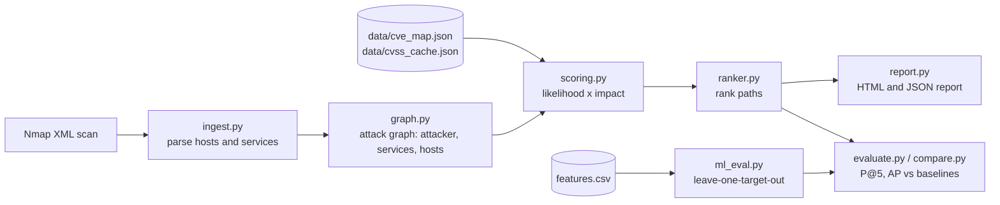

# AttackPath architecture

```mermaid
flowchart LR
    A[Nmap XML scan] --> B[ingest.py<br/>parse hosts and services]
    B --> C[graph.py<br/>attack graph: attacker, services, hosts]
    D[(data/cve_map.json<br/>data/cvss_cache.json)] --> E
    C --> E[scoring.py<br/>likelihood x impact]
    E --> F[ranker.py<br/>rank paths]
    F --> G[report.py<br/>HTML and JSON report]
    F --> H[evaluate.py / compare.py<br/>P@5, AP vs baselines]
    I[(features.csv)] --> J[ml_eval.py<br/>leave-one-target-out]
    J --> H
```
